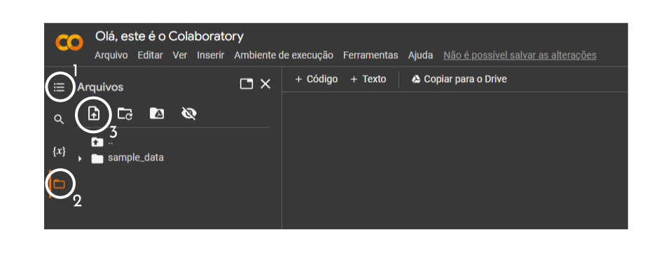

<h1>Seja bem vindo a Concreta</h1>

Olá eu sou a concreta a primeira IA brasileira para construída para determinar a resistência do concreto a partir de dados da dosagem. Venha conhecer um pouco da minha história. Eu sou uma das criações do GPEE (Grupo de Pesquisa e Estudos em Engenharia Civil) da UFCAT e estou aqui para ajudar você Engenheiro Civil e estudante de engenharia que deseja determinar propriedades do concreto.

 

<h2>Participantes do projeto</h2>

<ul>
  <li><a href="http://lattes.cnpq.br/2268506213083114" target="_blank">Prof. Wanderlei Malaquias Pereira Junior</a></li>
  <li><a href="http://lattes.cnpq.br/4025685702530313" target="_blank">Prof. Antover Panazzolo Sarmento</a></li>
  <li><a href="http://lattes.cnpq.br/8968151880884493" target="_blank">Prof. Rogério Pinto Espíndola</a></li>
  <li><a href="http://lattes.cnpq.br/8801080897723883" target="_blank">Prof. Daniel de Lima Araújo</a></li>
  <li><a href="http://lattes.cnpq.br/1543798708473666" target="_blank">Prof. Gustavo de Assis Costa</a></li>
  <li><a href="http://lattes.cnpq.br/0348866215558920" target="_blank">Eng. Ma. Amanda Isabela de Campos</a></li>
  <li>Comp. Lucas Elias de Andrade Cruvinel</li>
</ul>

<h2>Informações de uso da IA</h2>   

Eu fui construída empregando as ferramentas de aprendizado de máquina da linguagem Python. Para você me utilizar basta ter acesso a plataforma <b>Google Colaboratory</b>. Hoje o meu índice de acurácia é de <code>88%</code> e com o tempo sempre estou melhorando minha eficiência. Para entrar em contato com meus criadores basta enviar um e-mail para <code>wanderlei_junior@ufcat.edu.br</code>. 

<h3>Como me utilizar</h3>

Para você me utilizar em sua pesquisa ou no seu canteiro de obras basta fazer o <i>download</i> dos modelos disponibilizados seguir.  

<blockquote>
  <ol>
    <li>
      <a href="https://mega.nz/folder/z9cSQCZR#SWxN82BTINkFsgpjuYMDfg" target="_blank">Modelo notebook Jupyter
      </a>
    </li>
    <li>
      <a href="https://drive.google.com/drive/folders/1a-LD5YdRyOkVfchbnFniSQFCXoMkv1Kr?usp=sharing" target="_blank">IA Concreta
      </a>
    </li>
    <li>
      <a href="https://mega.nz/folder/Dl8hEbpT#NMu3OOt-iuR-mjY-2zEKpg" target="_blank">Modelo planilha Excel
      </a>
    </li>
  </ol>
</blockquote>

De posse dos arquivos com extensão <code>.sav</code> e do modelo em Excel preenchido, abra o <b>notebook jupyter exemplo</b> em seu Google Drive (Utilizar com a extensão <b>Google Colaboratory</b>) e então utilize a guia de índice (☰) do Colaboratory, que fica do lado esquerdo, para inserir os arquivos no ambiente (<code>.sav</code> e <code>.xlsx</code>).

Após fazer o <i>upload</i> dos arquivos basta clicar em <code><b>Ambiente de execução</b></code> e depois solicitar a opção<code><b>Executar tudo</b></code>. Ao fim do processo seu banco de dados estará completamente processado.

<h2><i>Disclaimer</i></h2>   

As informações de predição da <b>Concreta</b> não configuram uma recomendação de extinção de retirada de corpos de prova em obras ou concreteiras. Porém a IA auxilia os técnicas da área na obtenção de respostas em tempo real sobre a resistência mecânica do material. 

